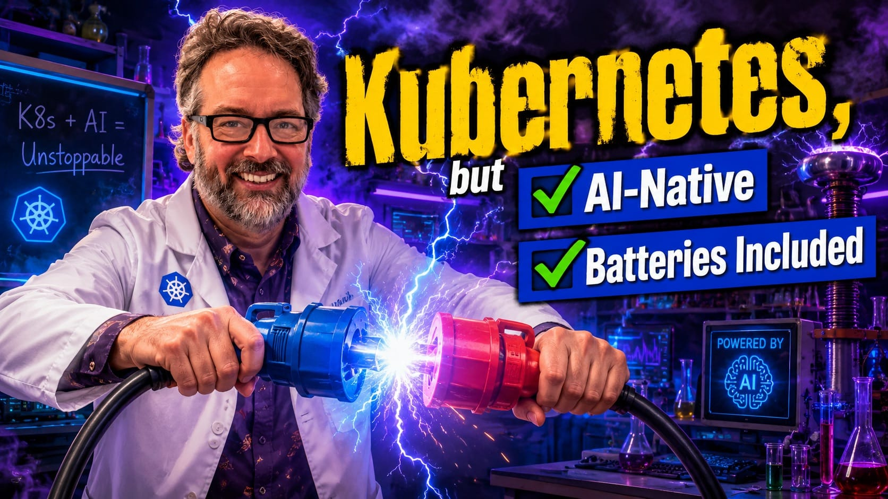

<!-- verified: 2026-10-05 -->
name: intro
toc: Getting started

## Getting started: Do these now

Welcome to the workshop! I'm glad you're here. Do these now, so we can start quickly:

1. There are two pinned links in chat: slides, and server GSheet

1. Open those slides in your browser: @@SLIDES@@

2. Navigate those slides with <- and ->

3. Open the GSheet link and pick a free row of servers

3. **Put your initials in that row**, so nobody else takes it

4. Copy down your node IPs, username, and password. Same user/pw for all nodes

5. SSH into `node1`: `ssh <username>@<IP>` (`mosh` and `et` also supported if you're fancy)

6. No SSH client? Use the web terminal: `http://<node1 IP>:1080` (**http**, not https)

---

## Introductions

.column-half[

- 👋 Hi, I'm **Bret Fisher**

- 🛠️ DevOps dude, trainer, & consultant

- 👨‍🎤 Your kids might call me a YouTuber 🙄

- 🐳 10-yr Docker Captain & CNCF Cloud Native Ambassador

- 🎓 [bretfisher.com][bretfisher]: courses, workshops, newsletter

- 🤝 Learning Agents in SRE or Platform Engineering? Join the [Agentic DevOps Guild][guild]

]

.column-half[

<!-- Markdown inside an HTML block (like 
) is not parsed, so keep
     the image as plain Markdown. -->
.center[]

<!-- Icons: Simple Icons (CC0), see images/social-*.svg. -->
.social[
[][youtube] ·
[][linkedin] ·
[][x] ·
[][bluesky] ·
[][instagram] ·
[][github]
]

]

[bretfisher]: https://www.bretfisher.com/
[youtube]: https://www.youtube.com/@BretFisher
[linkedin]: https://www.linkedin.com/in/bretefisher
[x]: https://x.com/bretfisher
[bluesky]: https://bsky.app/profile/bretfisher.com
[instagram]: https://www.instagram.com/bretfisher/
[github]: https://github.com/bretfisher
[guild]: https://www.bretfisher.com/theguild
